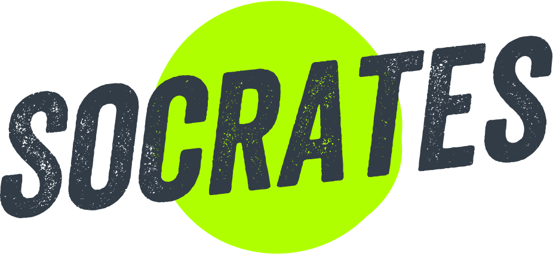

# Socrates `beta`
--

Socrates is the design system that powers Onefootball web projects

It's a custom version of Bootstrap, so to run it, Bootstrap 4 has to be included in your dependencies

It includes the following main packages:

- socrates-all `_socrates-all.scss` includes everything from Bootstrap and Socrates custom modules
- socrates-core `_socrates-core.scss` used on NewsDesk project
- socrates-product `_socrates-product.scss` used in Company website & Onefootball.com

### Module Status
1. Typography `Done`
2. Colors `Done`
3. Spacing `Done`
4. Grid `Done `
5. Icons `Done`
6. Buttons `Done`
7. Shadows `Done`
8. Alerts `Done`
9. Badges `Done`
10. Forms `Done`
11. Dropdowns `Done`
12. Navbars `In Progress`
13. Tabs `Done`
14. Modals `Done`

### Install & Run the docs
- clone this repo
- install fractal-cli `npm i -g @frctl/fractal`
- run `npm install`
- to recompile Scss `gulp css:process`
- to run fractal `gulp fractal:start`

### Usage

- open your terminal and write `npm i socrates-css --save`
- import the package you want inside your main Scss file like `@import "_socrates-core.scss";`

### What's next?
- There are few modules that I'm still working on.
- Any module requests are welcome.

### Who to ask
Please feel free to ask @zeroxme any questions or give feedback because the project is still in `Beta`